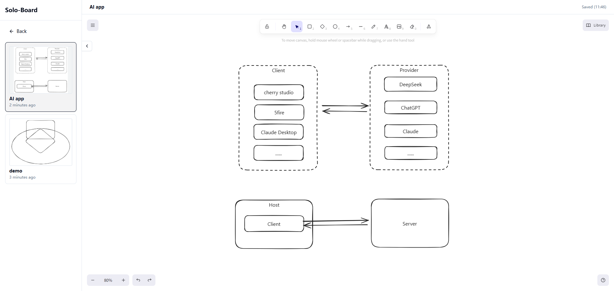

# solo-board

A lightweight, self-hosted solo whiteboard built on Excalidraw, designed for personal diagram and knowledge organization.

If you find this useful, a star would be appreciated. Pull requests and issues are welcome.

<p align="center">
  <a href="docs/assets/demo1.png">
    
  </a>
  <a href="docs/assets/demo2.png">
    
  </a>
  <br>
</p>

## Quick Start

### Docker (recommended)

```bash
docker run -d -p 3000:3000 --name solo-board pfeak/solo-board:latest
```

Open <http://localhost:3000>. To persist data, add a volume:

```bash
docker run -d -p 3000:3000 -v solo-board-data:/app/backend/data --name solo-board pfeak/solo-board:latest
```

### Docker Compose

For advanced or production usage, use docker-compose for easy environment management and data persistence.

```yaml
services:
  solo-board:
    image: pfeak/solo-board:latest
    container_name: solo-board
    ports:
      - "3000:3000"
    environment:
      - NODE_ENV=production
      - DATABASE_URL=file:/app/backend/data/dev.db
      - LOG_LEVEL=info
      - DEFAULT_ADMIN_USERNAME=admin
      - DEFAULT_ADMIN_PASSWORD=123456
    volumes:
      - ./data/solo-board-data:/app/backend/data
    restart: unless-stopped
```

To start:

```bash
docker-compose up -d
```

For more details, see [`deploy/docker-compose.yml`](deploy/docker-compose.yml).

### Prerequisites

- Node.js 18+
- `pnpm` (recommended) or `npm`

### 1. Clone repository

```bash
git clone https://github.com/pfeak/solo-board.git
cd solo-board
```

### 2. Backend: install & run

```bash
cd backend
pnpm install          # or: npm install
cp .env.example .env  # adjust values if needed
pnpm prisma:migrate   # or: npx prisma migrate dev
pnpm dev              # start Fastify API on http://localhost:8000
```

### 3. Frontend: install & run

Open a new terminal:

```bash
cd frontend
pnpm install          # or: npm install
pnpm dev              # start Next.js app on http://localhost:3000
```

Make sure the backend is running at `http://localhost:8000` (default). The frontend uses this URL via `NEXT_PUBLIC_API_URL` (can be overridden in a `.env.local` file).
